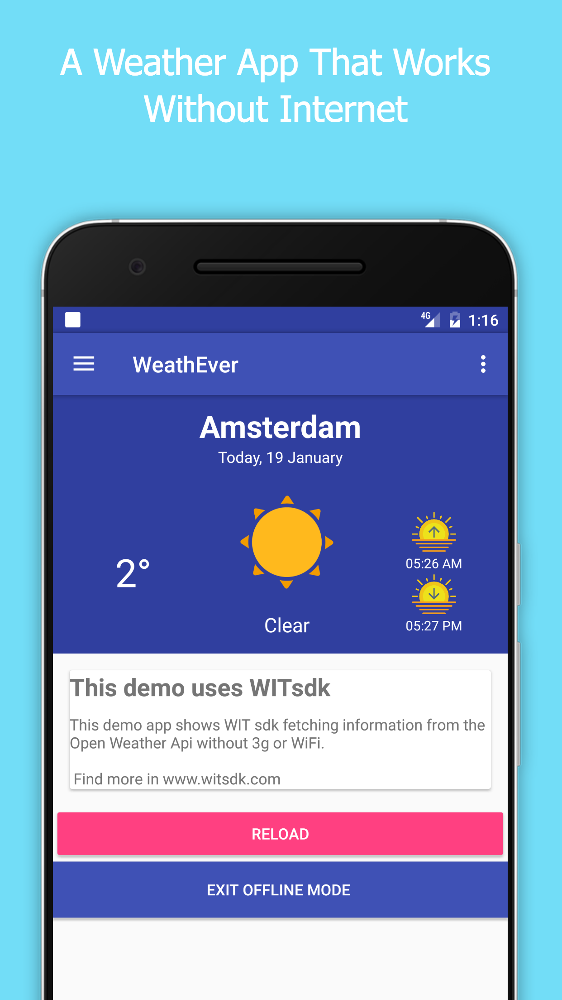
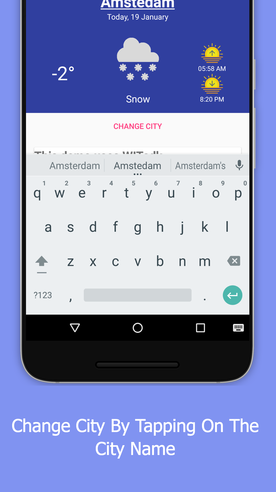
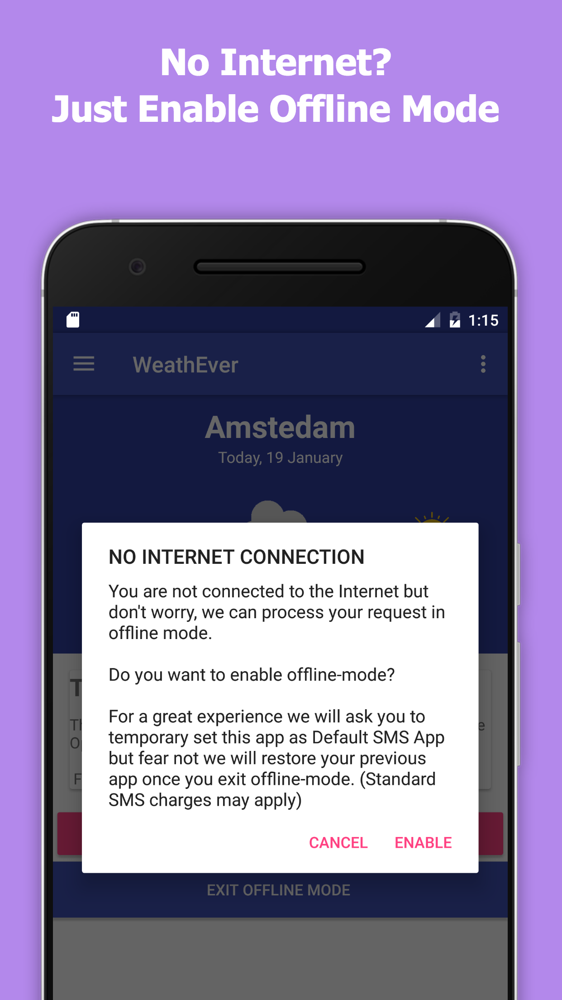
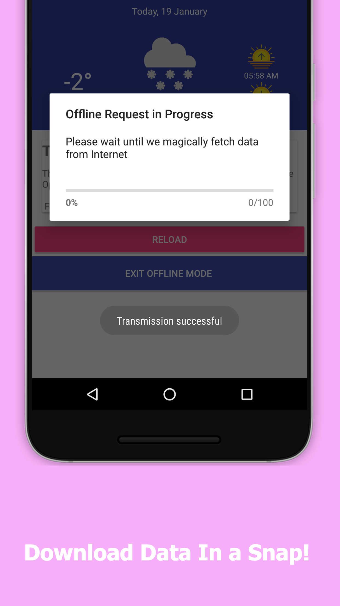

# WIT Android SDK *alpha* 0.6.0

*Please be patient :) this is a very early SDK*

WIT Android SDK is a library to give fallback connectivity to mobile Apps.
Using WIT SDK you can do any kind of HTTP Requests.
If the device is offline, the SMS Channel will be used.

Official WIT Android SDK to support:

- Internet backed HTTP Requests based on okHTTP
- Offline HTTP Requests via WIT Fallback on SMS
- Android 4.4 (Api 19), 5 and 6

## Generic http offline request

In the current version WIT SDK supports "generic requests" meaning that
you can throw(1) any kind of data to any url of choice which can result
in a big payload being sent via SMS.
Our system take care of compressing and optimizing the request you are doing.

Here at [WIT Technology](https://www.witsdk.com) we offer a premium support to any company.
We can optimize up to 70% the speed of the requests and as a consequence the prices for the data transportation.
Your endpoints will remain the same so you don't have to modify any code to take
advantage of this.

1) we support all HTTP Requests Verbs -> get|post|put|patch|delete

## Contact US

For any technical issue create it [here](https://github.com/WithoutInternetTechnology/wit-android-sdk/issues) or contact us at davide [ at ] witsdk.com.
For business operations, and to know more about our Premium Support write to alessio [ at ] witsdk.com.

## Example
### [Weather Example using WIT SDK](https://github.com/WithoutInternetTechnology/wit-android-sdk/tree/master/example_projects/WetherExample)
#### A simple weather app that works without internet





# Install

### Prerequisites

WIT SDK needs [okHttp3](https://github.com/square/okhttp) to work.

### Setup WIT SDK using Gradle

Clone this repository in your project root folder and execute these commands:

```bash
cd YourProject
git clone https://github.com/WithoutInternetTechnology/wit-android-sdk.git
cp -r ./wit-android-sdk/witsdk witsdk
```

In the build.gradle inside your 'app' folder, add WIT SDK and okHttp3:

```java
    dependencies {
        compile fileTree(include: ['*.aar'], dir: 'witsdk')

        ...
        compile 'com.squareup.okhttp3:okhttp:3.4.2'
        compile project(':witsdk')
    }
```

Inside your settings.gradle add ':witsdk', the file should look like:

```java
    include ':app',':witsdk'
```

## Use it

### Import the WIT SDK

    import com.witsdk.witcore.*;

### Initialize WIT
It's recommended to use the same instance ```client``` of the WIT library in the same activity.
The constructor ```new Wit(Activity this,FragmentManager fm); ``` takes 2 parameters: ```Activity```  and ```FragmentManager```, this is needed because WIT will handle automatically the permission flow required to use SMS in your app.

```java
public class MyActivity extends AppCompatActivity{
    private Wit client;

    @Override
    protected void onCreate(Bundle savedInstanceState) {
        super.onCreate(savedInstanceState);
        ....
        FragmentManager fm = getSupportFragmentManager();
        client = new Wit(this, fm);
        ...
    }

    @Override
    public void onActivityResult(int requestCode, int resultCode, Intent data) {
        client.onActivityResult(requestCode);
    }

    @Override
    public void onRequestPermissionsResult(int requestCode, String permissions[], int[] grantResults) {
        client.onRequestPermissionsResult();
    }
```

The  ```Activity``` need to override  ```onActivityResult()``` and ```onRequestPermissionsResult()``` has shown in the snipplet above, by doing this the ```Activity``` will be able to intercept the result of asking for SMS permission and communicate the result to ```(Wit) client```.

### GET Request
The http request below will be resolved either using internet or without, providing a consistent way for developer to fetch the data they need without having to worry if the device has internet connectivity.

```java

    String url = "http://jsonplaceholder.typicsode.com/posts/1";

    client.request(url, "get", null, new RequestListener() {
      @Override
      public void onSuccess(JSONObject json, Integer id) {
        Log.d("WIT REQ","RESPONSE "+ id.toString() +" : " + json.toString());
      }

      @Override
      public void onError(int code, String error) {
        Log.d("WIT REQ","ERROR "+ code +" : " + error);
      }
    });
```
### POST Request
```java

    JSONObject obj = new JSONObject();
    obj.put("id", 1);
    obj.put("title", "foo");
    obj.put("body", "bar");
    obj.put("userId", 1);

    client.request("http://jsonplaceholder.typicode.com/posts", "post", obj, new RequestListener() {
        @Override
        public void onSuccess(JSONObject json, Integer id) {
            Log.d("WIT SDK","POST REQUEST, Response: "+ id.toString() +" : " + json.toString());
        }

        @Override
        public void onError(int code, String error) {
            Log.d("WIT SDK","POST REQUEST, Error: "+ code +" : " + error);
        }
    });
```
### PUT Request
```java
    client.request(url, "put", obj, new RequestListener() {
        @Override
        public void onSuccess(JSONObject json, Integer id) {
            Log.d("WIT SDK","PUT REQUEST, Response: "+ id.toString() +" : " + json.toString());
        }

        @Override
        public void onError(int code, String error) {
            Log.d("WIT SDK","PUT REQUEST, Error: "+ code +" : " + error);
        }
    });
```
### PATCH Request
```java
    client.request(url, "patch", obj, new RequestListener() {
        @Override
        public void onSuccess(JSONObject json, Integer id) {
            Log.d("WIT SDK","PATCH REQUEST, Response: "+ id.toString() +" : " + json.toString());
        }

        @Override
        public void onError(int code, String error) {
            Log.d("WIT SDK","PATCH REQUEST, Error: "+ code +" : " + error);
        }
    });
```
### DELETE Request
```java
    client.request(url, "delete", null, new RequestListener() {
        @Override
        public void onSuccess(JSONObject json, Integer id) {
            Log.d("WIT SDK","DELETE REQUEST, Response: "+ id.toString() +" : " + json.toString());
        }

        @Override
        public void onError(int code, String error) {
            Log.d("WIT SDK","DELETE REQUEST, Error: "+ code +" : " + error);
        }
    });
```

### Add HEADERS to your Request

Initialize a Map variable

```java
  final Map<String, String> headers = new HashMap<String, String>() {{
        put("auth", "Password");
        put("Bearer ", "auth_token");
    }};
```

```java
    client.request(url, "post", headers, obj, new RequestListener() {
        @Override
        public void onSuccess(JSONObject json, Integer id) {
            Log.d("WIT SDK","DELETE REQUEST, Response: "+ id.toString() +" : " + json.toString());
        }

        @Override
        public void onError(int code, String error) {
            Log.d("WIT SDK","DELETE REQUEST, Error: "+ code +" : " + error);
        }
    });
```

### Disable Offline Mode

This function will trigger the system dialog to restore the default SMS app selected before switching to Offline Mode.
```java
    client.disableOfflineMode();
```

### License

Copyright (C) WIT Technology, LTD - All Rights Reserved
